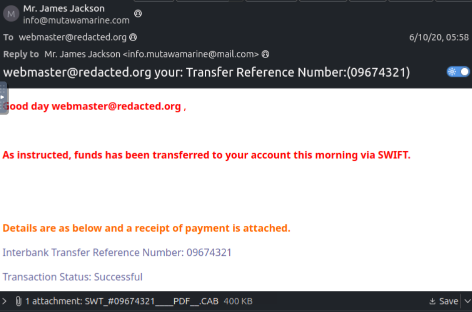

`difficulty: easy` `Theme: Phishing`

At first glance, we can see the following email:



### Q1. What is the `Transfer Reference Number` listed in the email's **Subject** line?

`Answer: 09674321`
We can see it in the header of the email.

### Q2. What is the display name of the sender?

`Answer: Mr.James Jackson`
We can see it in the header of the email.

### Q3. What is the sender's email address?

`Answer: info@mutawamarine.com`
Under the display name.

### Q4. What email address will receive a reply to this email?

`Answer: info.mutawamarine@mailcom`
We can see it in the "Reply to" field

### Q5. What is the originating IP address of this email?

`Answer: 192.119.71.157`

Ctrl+u in order to inspect the email.
We can see the source IP address in the following line. It is the first transmission of data that was produced.
````
Received: from hwsrv-737338.hostwindsdns.com ([192.119.71.157]:51810 helo=mutawamarine.com)
by sub.redacted.com with esmtp (Exim 4.80)
````

### Q6. Who is the owner of the originating IP?

`Answer: Hostwinds LLC`

The lab actually didn´t accept my answer, but after investigating on VirusTotal, AbuseIPDB and online sources, I concluded that Hostwinds LLC must be the owner.
I also checked other people´s write-ups and they came to the same conclusion.

### Q7. What is the full SPF record for this domain?

`Answer: v=spf1 include:spf.protection.outlook.com -all`

I searched in mxtoolbox.com the following line: *spf:mutawamarine.com*

### Q8. What is the complete DMARC record for this domain?

`Answer: v=DMARC1; p=quarantine; fo=1`

mxtoolbox.com helped me again. *dmarc:mutawamarine.com*

### Q9. What is the file name of the attachment found in the email?

`Answer: SWT_#09674321____PDF__.CAB`

### Q10. Using the `sha256sum` command, what is the `SHA256` hash of the file?

`Answer: 2e91c533615a9bb8929ac4bb76707b2444597ce063d84a4b33525e25074fff3f`

I adquired via terminal the hash using the command sha256sum

### Q11. What is the attachment's file size in `KB` (e.g., `122.31 KB`)?

`Answer:400.26 KB`

I searched the hash in VirusTotal.

### Q12. What is the actual file type of the attachment?

`Answer: RAR`

VirusTotal.


